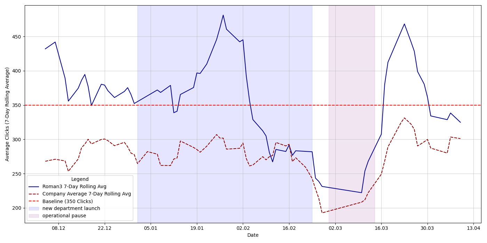

# Employee Performance Analytics: A Data-Driven Approach to Evaluating KPI

## 📌 Project Summary
An automated **analytical system and data pipeline** designed to replace subjective workplace metrics with empirical KPI tracking. The system ingests highly noisy visual data (photographs of screen reports) and transforms it into structured, production-ready time-series insights.

*   **Scale:** Analyzed performance metrics for **78 employees over a 130-day period**.
*   **Tech Stack:** Python, OpenCV (cv2), EasyOCR, Pandas, Google Colab.
*   **Core Challenges Solved:** Spatial text reconstruction from low-quality images and custom data deduplication.

## 💡 Findings & Conclusions

 
   
  
<i>Figure 7: Sustained Trend Analysis – 'Roman3' 7-day rolling average vs. company-wide performance baseline.</i>

The data-driven analysis provided clear, empirical evidence regarding the employee's actual performance level.

**Key Insights:**
*   **Consistent Excellence:** The analyzed employee consistently exceeded the minimum performance baseline and demonstrated higher output compared to the majority of the 78-person team, including recently onboarded staff.
*   **Contextual Output:** The performance remained stable and above average even during periods of high operational load, such as the launch of a new department (Sabon) and other external disruptive events.
*   **Final Verdict:** The objective data definitively confirms the employee’s high efficiency, consistency, and dedication to the required metrics, refuting any subjective claims of underperformance.

## 📊 Business Context & Metrics
*   **Primary Metric:** "Clicks" (Successful barcode scans performed via a Mobile Data Terminal - MDT).
*   **Performance Baseline:** A standard shift requirement is **350 clicks**.
*   **The Data Source:** Visual reports (photographs) of Excel pivot tables containing `Employee Name` and `Click Count`.

## 🎯 The Analytical Objective
The goal was to visualize and evaluate performance relative to:
1.  **The Baseline:** The minimum required output (350 clicks).
2.  **Peer Performance:** Comparison with the rest of the 78-person team.
3.  **Contextual Factors:** Accounting for periods of high-stress operations and departmental launches.

## 🛠 Tech Stack & Data Pipeline

The architecture is intentionally split into two distinct Google Colab notebooks. This decoupling was implemented because the development and analysis spanned multiple days. By separating the resource-heavy Optical Character Recognition (**OCR**) engine from the analytical workflows, the system allows for rapid iteration on business analytics without the need to re-initialize and rerun the computationally expensive image-processing logic every time.

### 1. Computer Vision (OCR) Module
Since the raw data existed only as photos of a screen, a robust OCR pipeline was developed to convert visual noise into structured data.
*   **Image Preprocessing:** Implementing Gaussian Blur to remove Moire patterns (screen interference), CLAHE for contrast enhancement, and Unsharp Masking for character definition.
*   **Extraction:** Leveraging EasyOCR to detect and recognize text in low-quality images.
*   **Transformation & Reconstruction Logic:** Mapping bounding box coordinates to reconstruct logical lines from scattered text blocks, exporting the cleaned data into a structured format: `[File Date, Filename, Employee Name, Click Count]`.

### 2. Analytical Module (Data Integrity & Cleaning)
A critical challenge was handling duplicated or incomplete data, as multiple photos were often taken within a single day.
*   **Deduplication Logic:** The system identifies that only the *last* snapshot of a given day contains the final, accurate cumulative totals.
*   **Time-Series Generation:** Extracting metadata from filenames to build a historical performance timeline over the 130-day period.
*   **Comparative Analysis:** Aggregating metrics to compare individual output against the 350-click baseline and the team average.